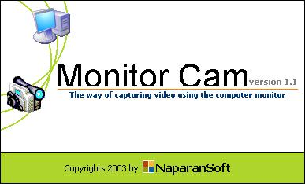



## \_MonitorCam \( A New Way Of Capturing Video \)

### Description

Hello friends are you tired of making Banking System , Account Recivable System , Inventory System , Accounting System , Billing System and any other application? well, set down and relax. By downloading this application you will enjoy viewing live your self in your monitor without using webcams or any video cameras, well if you don't have a webcam just download this application you will have a camera that better than a webcam because what the webcam or any other video cameras can do? can also be done using this application.READ ALL TEXT IN THE RUNNING APPLICATION FOR MORE INFORMATION ABOUT THIS.
 
### More Info
 

             |
---                |---
**Submitted On**   |2003-11-19 08:03:44
**By**             |[Philip  V\. Naparan :\-\)](https://github.com/Planet-Source-Code/PSCIndex/blob/master/ByAuthor/philip-v-naparan.md)
**Level**          |Beginner
**User Rating**    |3.7 (77 globes from 21 users)
**Compatibility**  |VB 3\.0, VB 4\.0 \(16\-bit\), VB 4\.0 \(32\-bit\), VB 5\.0, VB 6\.0, VB Script, ASP \(Active Server Pages\) , VBA MS Access, VBA MS Excel
**Category**       |[Jokes/ Humor](https://github.com/Planet-Source-Code/PSCIndex/blob/master/ByCategory/jokes-humor__1-40.md)
**World**          |[Visual Basic](https://github.com/Planet-Source-Code/PSCIndex/blob/master/ByWorld/visual-basic.md)
**Archive File**   |[\_MonitorCa1678481212003\.zip](https://github.com/Planet-Source-Code/philip-v-naparan-monitorcam-a-new-way-of-capturing-video__1-50234/archive/master.zip)

